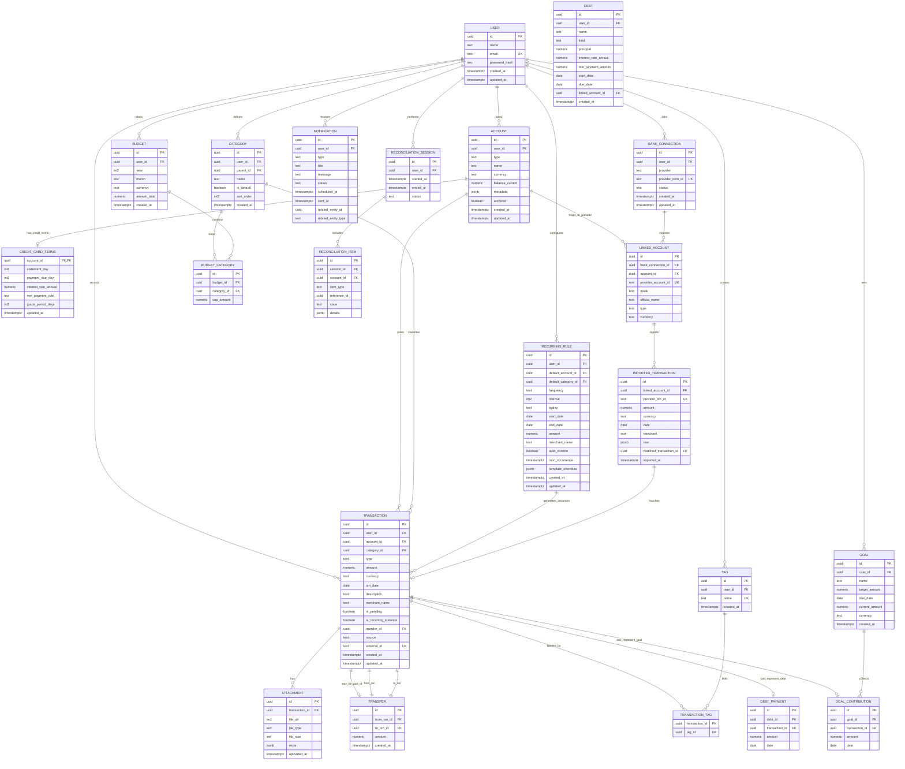

# ER Diagram

```mermaid
%% Enumeradores y valores válidos:
%% ACCOUNT.type: cash|debit|credit|savings|ewallet
%% ACCOUNT.currency: ISO-4217
%% ACCOUNT.metadata: bank,color,last4,icon
%% CREDIT_CARD_TERMS.statement_day: 1-28
%% CREDIT_CARD_TERMS.payment_due_day: 1-28
%% CREDIT_CARD_TERMS.min_payment_rule: fixed|percent|provider
%% CATEGORY.user_id: null => default category
%% TRANSACTION.type: income|expense|transfer|adjustment
%% TRANSACTION.source: manual|imported|ocr|sms
%% TRANSACTION.external_id: provider txn id hash
%% ATTACHMENT.extra: e.g., CEP from Banxico
%% RECURRING_RULE.frequency: daily|weekly|monthly|custom
%% RECURRING_RULE.interval: every N units
%% RECURRING_RULE.byday: MO,TU,... (optional)
%% RECURRING_RULE.auto_confirm: if true, auto-post on match
%% GOAL.current_amount: cached
%% DEBT.kind: loan|card|other
%% DEBT.linked_account_id: optional
%% NOTIFICATION.type: budget|debt_due|recurring|summary
%% NOTIFICATION.status: scheduled|sent|read|dismissed
%% BANK_CONNECTION.provider: belvo|paybook|other
%% BANK_CONNECTION.status: active|revoked|error
%% LINKED_ACCOUNT.mask: last4
%% RECONCILIATION_SESSION.status: open|closed
%% RECONCILIATION_ITEM.item_type: balance|transaction
%% RECONCILIATION_ITEM.reference_id: txn id or snapshot id
%% RECONCILIATION_ITEM.state: confirmed|corrected|ignored

erDiagram
  USER ||--o{ ACCOUNT : owns
  USER ||--o{ CATEGORY : defines
  USER ||--o{ TRANSACTION : records
  USER ||--o{ RECURRING_RULE : configures
  USER ||--o{ BUDGET : plans
  USER ||--o{ GOAL : sets
  USER ||--o{ NOTIFICATION : receives
  USER ||--o{ BANK_CONNECTION : links
  USER ||--o{ RECONCILIATION_SESSION : performs
  USER ||--o{ TAG : creates

  ACCOUNT ||--o{ TRANSACTION : posts
  ACCOUNT ||--o| CREDIT_CARD_TERMS : has_credit_terms
  ACCOUNT ||--o{ LINKED_ACCOUNT : maps_to_provider

  CATEGORY ||--o{ TRANSACTION : classifies
  CATEGORY ||--o{ BUDGET_CATEGORY : caps

  TRANSACTION ||--o{ ATTACHMENT : has
  TRANSACTION ||--o| TRANSFER : may_be_part_of
  TRANSACTION ||--o{ TRANSACTION_TAG : labeled_by
  TRANSACTION ||--o| DEBT_PAYMENT : can_represent_debt
  TRANSACTION ||--o| GOAL_CONTRIBUTION : can_represent_goal

  TRANSFER ||--|| TRANSACTION : from_txn
  TRANSFER ||--|| TRANSACTION : to_txn

  RECURRING_RULE ||--o{ TRANSACTION : generates_instances

  BUDGET ||--o{ BUDGET_CATEGORY : contains

  GOAL ||--o{ GOAL_CONTRIBUTION : collects

  BANK_CONNECTION ||--o{ LINKED_ACCOUNT : exposes
  LINKED_ACCOUNT ||--o{ IMPORTED_TRANSACTION : ingests
  IMPORTED_TRANSACTION ||--o| TRANSACTION : matches

  RECONCILIATION_SESSION ||--o{ RECONCILIATION_ITEM : includes

  TAG ||--o{ TRANSACTION_TAG : links

  USER {
    uuid id PK
    text name
    text email UK
    text password_hash
    timestamptz created_at
    timestamptz updated_at
  }

  ACCOUNT {
    uuid id PK
    uuid user_id FK
    text type
    text name
    text currency
    numeric balance_current
    jsonb metadata
    boolean archived
    timestamptz created_at
    timestamptz updated_at
  }

  CREDIT_CARD_TERMS {
    uuid account_id PK,FK
    int2 statement_day
    int2 payment_due_day
    numeric interest_rate_annual
    text min_payment_rule
    int2 grace_period_days
    timestamptz updated_at
  }

  CATEGORY {
    uuid id PK
    uuid user_id FK
    uuid parent_id FK
    text name
    boolean is_default
    int2 sort_order
    timestamptz created_at
  }

  TRANSACTION {
    uuid id PK
    uuid user_id FK
    uuid account_id FK
    uuid category_id FK
    text type
    numeric amount
    text currency
    date txn_date
    text description
    text merchant_name
    boolean is_pending
    boolean is_recurring_instance
    uuid transfer_id FK
    text source
    text external_id UK
    timestamptz created_at
    timestamptz updated_at
  }

  TRANSFER {
    uuid id PK
    uuid from_txn_id FK
    uuid to_txn_id FK
    numeric amount
    timestamptz created_at
  }

  ATTACHMENT {
    uuid id PK
    uuid transaction_id FK
    text file_url
    text file_type
    int4 file_size
    jsonb extra
    timestamptz uploaded_at
  }

  RECURRING_RULE {
    uuid id PK
    uuid user_id FK
    uuid default_account_id FK
    uuid default_category_id FK
    text frequency
    int2 interval
    text byday
    date start_date
    date end_date
    numeric amount
    text merchant_name
    boolean auto_confirm
    timestamptz next_occurrence
    jsonb template_overrides
    timestamptz created_at
    timestamptz updated_at
  }

  BUDGET {
    uuid id PK
    uuid user_id FK
    int2 year
    int2 month
    text currency
    numeric amount_total
    timestamptz created_at
  }

  BUDGET_CATEGORY {
    uuid id PK
    uuid budget_id FK
    uuid category_id FK
    numeric cap_amount
  }

  GOAL {
    uuid id PK
    uuid user_id FK
    text name
    numeric target_amount
    date due_date
    numeric current_amount
    text currency
    timestamptz created_at
  }

  GOAL_CONTRIBUTION {
    uuid id PK
    uuid goal_id FK
    uuid transaction_id FK
    numeric amount
    date date
  }

  DEBT {
    uuid id PK
    uuid user_id FK
    text name
    text kind
    numeric principal
    numeric interest_rate_annual
    numeric min_payment_amount
    date start_date
    date due_date
    uuid linked_account_id FK
    timestamptz created_at
  }

  DEBT_PAYMENT {
    uuid id PK
    uuid debt_id FK
    uuid transaction_id FK
    numeric amount
    date date
  }

  NOTIFICATION {
    uuid id PK
    uuid user_id FK
    text type
    text title
    text message
    text status
    timestamptz scheduled_at
    timestamptz sent_at
    uuid related_entity_id
    text related_entity_type
  }

  BANK_CONNECTION {
    uuid id PK
    uuid user_id FK
    text provider
    text provider_item_id UK
    text status
    timestamptz created_at
    timestamptz updated_at
  }

  LINKED_ACCOUNT {
    uuid id PK
    uuid bank_connection_id FK
    uuid account_id FK
    text provider_account_id UK
    text mask
    text official_name
    text type
    text currency
  }

  IMPORTED_TRANSACTION {
    uuid id PK
    uuid linked_account_id FK
    text provider_txn_id UK
    numeric amount
    text currency
    date date
    text merchant
    jsonb raw
    uuid matched_transaction_id FK
    timestamptz imported_at
  }

  RECONCILIATION_SESSION {
    uuid id PK
    uuid user_id FK
    timestamptz started_at
    timestamptz ended_at
    text status
  }

  RECONCILIATION_ITEM {
    uuid id PK
    uuid session_id FK
    uuid account_id FK
    text item_type
    uuid reference_id
    text state
    jsonb details
  }

  TAG {
    uuid id PK
    uuid user_id FK
    text name UK
    timestamptz created_at
  }

  TRANSACTION_TAG {
    uuid transaction_id FK
    uuid tag_id FK
  }
```
